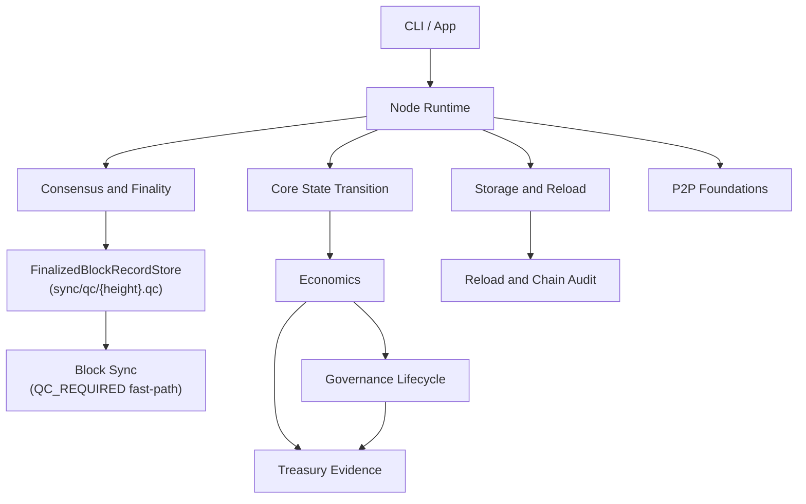

<p align="center">
  
</p>

<p align="center">
  Security-first blockchain infrastructure for verifiable protection, auditable economics, controlled treasury execution, governance evidence, and rebuildable state.
</p>

<p align="center">
  <a href="https://github.com/igors93/nodo/actions/workflows/ci.yml"></a>
  
  
  
  
  
</p>

<p align="center">
  <a href="#overview">Overview</a> |
  <a href="#features">Features</a> |
  <a href="#quick-start">Quick Start</a> |
  <a href="#architecture">Architecture</a> |
  <a href="#documentation">Documentation</a> |
  <a href="#roadmap">Roadmap</a>
</p>

## Overview

Nodo is an experimental C++20 blockchain protocol foundation focused on making security work measurable, state auditable, economics controlled, and finalized history rebuildable.

The current repository is not a production mainnet. It contains a working localnet runtime, testnet-candidate foundations, strict storage/reload checks, P2P transport foundations, treasury execution evidence, governance vote evidence, and extensive tests. Mainnet remains intentionally blocked until custody, networking, economics, storage, and operational safety have been audited and hardened.

## Why Nodo

Many blockchain systems treat protection as background infrastructure. Nodo treats protection as a protocol concern: validators, peers, treasury actions, governance decisions, rewards, penalties, storage, reload, and finality should leave evidence that another node can verify later.

The design target is simple:

- state should be rebuilt from history;
- balances should have origin;
- monetary changes should be authorized;
- treasury spends should be policy checked;
- governance decisions should be vote-evidence backed;
- penalties should require evidence;
- rewards should be tied to measurable protection work.

## Core Principles

Nodo follows the Proof-of-Protection rule set:

| Principle | Meaning |
| --- | --- |
| No inflation without authorization. | Monetary expansion must be explicit and auditable. |
| No balance without origin. | Account state must trace back to genesis, mint, transfer, reward, or slash history. |
| No treasury spend without policy validation. | Treasury execution must satisfy limits, timelocks, approval, balance, and epoch checks. |
| No treasury approval without governance evidence. | Approvals must be reproduced from verified governance lifecycle records. |
| No governance decision without verifiable vote evidence. | Votes, tally, and decision must rebuild deterministically. |
| No reward without measurable protection work. | Reward foundations should be tied to auditable network protection. |
| No penalty without verifiable evidence. | Slashing and penalties must be idempotent and evidence-backed. |
| No state accepted if it cannot be rebuilt from history. | Reload and audit reject non-canonical or divergent state. |

See [Proof of Protection](docs/overview/proof-of-protection.md) for the deeper model.

## Features

Implemented foundations include:

- localnet development pipeline with initialization, transaction submission, local PRECOMMIT-backed block production, finalization, reload, and audit;
- CMake-based C++20 build with one test executable per `tests/**/*.cpp`;
- strict storage schema validation and atomic persistence helpers (`AtomicFile` crash-safe writes);
- canonical finalized artifacts with monetary, treasury, governance, validator, and slashing sections;
- authoritative state-transition execution before block votes and unified canonical replay of accounts plus protocol domains into deterministic state/receipts roots, with coin lot ownership validation and CoinLot registry digest included in the state root commitment;
- OpenSSL Ed25519 user signatures and blst BLS12-381 validator signatures;
- BFT consensus with Quorum Certificate (QC) requiring 2/3+ validator weight from PRECOMMIT votes only;
- durable QC persistence: `FinalizedBlockRecordStore` writes each QC proof atomically to `{dataDir}/sync/qc/{height}.qc`, reloads all records at startup, and restores the in-memory `BlockFinalizationRegistry` — making the fast-path `QC_REQUIRED` sync mode functional across restarts;
- P2P message, gossip, loopback, TCP, encrypted peer-channel, sync, and peer-rate-limiter foundations;
- distributed node daemon with transaction gossip relay, block proposal relay with proposer authentication, PREVOTE/PRECOMMIT voting, finalized artifact QC verification, and a real JSON-RPC public API at `POST /rpc`;
- treasury policy, spend validation, execution evidence, and finalized treasury audit;
- governance vote proof, vote evidence, vote-set audit, tally, decision audit, lifecycle persistence, and lifecycle-backed treasury approval;
- slashing evidence for conflicting votes and proposer equivocation with deterministic penalty effects across ValidatorPenaltyLedger, ValidatorRegistry and StakingRegistry;
- testnet-candidate readiness and operator diagnostics foundations.

## Current Status

| Area | Status |
| --- | --- |
| Localnet runtime | Implemented for development and testing. |
| Testnet candidate | Foundations exist; safety gates and diagnostics are active. |
| Mainnet | Blocked by design. Not suitable for production use. |
| QC persistence | Fully implemented; QC proofs survive node restart. |
| Block sync | Fast-path (`QC_REQUIRED`) and persistent-path both implemented and tested. |
| P2P networking | Real socket/gossip transport, peer authentication, discovery, banning/quarantine, rate limiting and eclipse protection are implemented and tested; live distributed consensus over TCP (proposer selection, two-phase prevote/precommit, view change on timeout) is implemented and tested (Phase 2 complete). |
| Keys and custody | Local development keys exist; production custody is not ready. |
| Governance | Vote evidence and lifecycle audit foundations exist; public governance workflow is still in development. |
| Treasury | Evidence-backed execution validation exists; production operator process is still in development. |
| Economics | Monetary, reward, protection, penalty, and supply-audit foundations exist; CoinLot validation wired into block preview and state root; final economic activation is not complete. |

## Quick Start

### Windows PowerShell

```powershell
$env:BLST_ROOT="$env:USERPROFILE\.nodo\deps\blst"
.\scripts\cmake_build.bat
.\scripts\cmake_test_all.bat
.\build\nodo.exe help
```

### Linux, macOS, Git Bash, or MSYS2

```bash
export BLST_ROOT="$HOME/.nodo/deps/blst"
./scripts/cmake_build.sh
./scripts/cmake_test_all.sh
./build/nodo help
```

If `blst` is not installed, see [Build](docs/getting-started/build.md).

## Build

Prerequisites:

- CMake 3.20 or newer;
- a C++20 compiler;
- OpenSSL libcrypto development files;
- external `blst` headers and library, installed outside this repository.

Windows:

```powershell
.\scripts\cmake_build.bat
```

Linux/macOS/MSYS2:

```bash
./scripts/cmake_build.sh
```

The binary is written to:

```text
build/nodo.exe   # Windows
build/nodo       # Unix-like environments
```

## Run Tests

Windows:

```powershell
.\scripts\cmake_test_all.bat
```

Linux/macOS/MSYS2:

```bash
./scripts/cmake_test_all.sh
```

CTest can also be run directly:

```bash
ctest --test-dir build/cmake --output-on-failure
```

## CLI / Node Commands

Common localnet flow:

```bash
build/nodo init --network localnet --data-dir .nodo
build/nodo keys create --network localnet --data-dir .nodo
build/nodo tx submit --data-dir .nodo
build/nodo block produce --data-dir .nodo
build/nodo node reload --network localnet --data-dir .nodo
build/nodo chain audit --data-dir .nodo
build/nodo status --data-dir .nodo
build/nodo diagnostics --network localnet --data-dir .nodo
```

Network profiles:

- `localnet`: development runtime path;
- `testnet-candidate`: official pre-testnet profile with safety gates;
- `mainnet`: intentionally blocked.

More commands are documented in [CLI](docs/getting-started/cli.md).

The official public protocol API is JSON-RPC 2.0 over HTTP at `POST /rpc`; REST routes remain available for local operational diagnostics and backward-compatible tooling. Operational health and metrics are exposed at `GET /health`, `GET /metrics`, `GET /metrics/prometheus`, and JSON-RPC methods `nodo_getHealth` / `nodo_getMetrics`. See [JSON-RPC public API](docs/development/json-rpc-public-api.md) and [metrics/health observability](docs/development/metrics-health-observability.md).

## Project Structure

| Path | Purpose |
| --- | --- |
| `apps/cli/` | CLI executable entrypoint. |
| `include/` | Public headers for protocol, runtime, economics, storage, P2P, and utilities. |
| `src/app/` | Command-line orchestration and local operator flows. |
| `src/core/` | Blocks, transactions, account state, validators, and state-transition foundations. |
| `src/consensus/` | Votes, rounds, quorum certificates, finalization, and proposer scheduling. |
| `src/economics/` | Monetary policy, treasury, governance, protection rewards, supply audit, and penalties. |
| `src/node/` | Runtime, storage/reload, finalized artifacts, QC persistence, diagnostics, readiness, and chain audit. |
| `src/p2p/` | Messages, gossip, TCP/loopback transport, sync, encryption, and peer limiting. |
| `src/storage/` | Atomic files, block storage, evidence stores, and persistence helpers. |
| `tests/` | CTest-discovered module tests (one executable per file, named `{module}_{TestFile}`). |
| `scripts/` | Build, test, cleanup, and dependency helper scripts. |
| `docs/` | Project documentation. |

### Storage Layout

```text
{dataDirectory}/
├── manifest               — latest height, hash, and state root
├── schema                 — storage schema version
├── blocks/                — finalized block artifact files
├── mempool/               — persistent mempool transactions
├── sync/
│   ├── checkpoint.conf    — block sync checkpoint (last synced height)
│   └── qc/
│       ├── 1.qc           — FinalizedBlockRecord (QC proof) for height 1
│       ├── 2.qc           — FinalizedBlockRecord (QC proof) for height 2
│       └── ...
└── ...
```

Each `.qc` file is written atomically via temp file + rename. On startup, all `.qc` files are loaded and the in-memory `BlockFinalizationRegistry` is restored before sync or consensus resumes.

## Architecture



Read [Architecture Overview](docs/architecture/architecture-overview.md) and [Module Map](docs/architecture/module-map.md).

### QC Persistence Flow

`FinalizedBlockRecord` (containing the BLS12-381 Quorum Certificate) is persisted from three entry points and reloaded on startup:

```text
1. Consensus-driven finalization
   ConsensusEventLoop → setFinalizedCallback
     └── persistFinalizedRecord()    → sync/qc/{height}.qc

2. Persistent-path batch sync
   PersistentBlockStateSyncApplier::applyValidatedBatch
     └── deserialize serializedFinalizedRecord from batch item
     └── persistFinalizedRecord()    → sync/qc/{height}.qc

3. Gossip-received finalized artifact
   NodeDaemon::processFinalizedArtifacts
     └── FinalizedBlockRecord::deserialize + verify QC
     └── FinalizedBlockRecordStore::save()  → sync/qc/{height}.qc

Startup reload
   NodeOrchestrator::initOrLoad
     └── FinalizedBlockRecordStore::loadAll()
     └── BlockFinalizationRegistry::registerFinalizedBlock() (per record)
```

Sync responses built by `buildSyncResponseBatch()` include the serialized QC for each block, so receiving peers can verify finality without contacting a third party.

### Daemon and Gossip Flow

`NodeDaemon` wraps `NodeOrchestrator` and adds a tick-driven gossip processing layer:

```text
NodeDaemon.tick()
  ├── NodeOrchestrator.tick()          — transport I/O, peer heartbeats, block sync
  ├── processTransactionGossip()       — drain TRANSACTION_GOSSIP inbox
  │     ├── SeenTransactionCache       — LRU+TTL dedup by payloadHash
  │     ├── PersistentMempoolStore::deserializeGossip()          — decode + Ed25519 verify
  │     ├── TransactionAdmissionValidator                       — account + domain admission
  │     └── gossipBroadcast()          — relay if newly admitted
  └── processFinalizedArtifacts()      — drain FINALIZED_BLOCK_ARTIFACT inbox
        ├── FinalizedBlockRecord::deserialize()
        ├── record.verify()            — QC check vs. local validator registry
        ├── FinalizationRegistry::registerFinalizedBlock()
        └── FinalizedBlockRecordStore::save()   — persist QC to disk
```

`ConsensusEventLoop` runs in a background thread inside `NodeOrchestrator`. It validates `BLOCK_PROPOSAL` messages, retains the active candidate outside the canonical chain, accumulates `PREVOTE` and `PRECOMMIT` `VALIDATOR_VOTE` messages, assembles a `QuorumCertificate` only from PRECOMMIT votes, and delegates the only distributed-network append to `BlockFinalizer` after quorum. The local `block produce` command uses a DEVELOPMENT_LOCAL-only helper and is rejected on testnet-candidate and production network classes.

## Documentation

Start with [docs/README.md](docs/README.md).

Key entry points:

- [Project Overview](docs/overview/project-overview.md)
- [Proof of Protection](docs/overview/proof-of-protection.md)
- [Quick Start](docs/getting-started/quick-start.md)
- [Build](docs/getting-started/build.md)
- [Testing](docs/getting-started/testing.md)
- [Architecture Overview](docs/architecture/architecture-overview.md)
- [Persistent Block State Sync](docs/PERSISTENT_BLOCK_STATE_SYNC.md)
- [Governance Vote Evidence](docs/governance/vote-evidence.md)
- [Treasury Execution Evidence](docs/treasury/treasury-execution-evidence.md)
- [Security Model](docs/security/security-model.md)
- [Roadmap](docs/ROADMAP.md)

## Roadmap

Completed foundations:

- localnet runtime pipeline;
- finalized artifact persistence and reload audit;
- monetary reports and supply audit foundations;
- treasury execution evidence;
- governance vote evidence and lifecycle audit;
- P2P transport/gossip/encrypted channel foundations;
- testnet-candidate readiness diagnostics;
- distributed node daemon: transaction gossip, block proposal relay, proposer authentication, finalized artifact QC verification;
- durable QC persistence (`FinalizedBlockRecordStore`): QC proofs survive restart, fast-path `QC_REQUIRED` sync is fully functional, sync responses carry QC proofs to peers;
- signed consensus-vote recovery: `ConsensusRecoveryStore` persists exact signed PREVOTE/PRECOMMIT records so restart can safely resubmit/rebroadcast the same votes without double-voting;
- canonical slashing penalties: finalized evidence creates one deterministic penalty decision, updates validator jail/tombstone status and applies bounded stake slashing into the staking registry;
- live distributed consensus (Phase 2): proposer selection wired to the daemon, networked prevote/precommit driven by round timeout, view change with proposer rotation on timeout, all tested end-to-end over real TCP;
- network hardening and peer operations (Phase 3): authenticated peer handshake and encrypted channel, live peer discovery, banning/quarantine, per-message-type rate limiting, exponential-backoff reconnection, eclipse-attack subnet protection.

In progress:

- official testnet runtime hardening;
- production key safety and custody boundaries;
- governance lifecycle transitions (network gossip of proposals across peers is not yet wired; decision/execution and audit are implemented);
- validator reward settlement and protection scoring.

Planned:

- audited wallet/custody integration;
- staking-backed governance and validator economics;
- full production slashing lifecycle;
- mainnet readiness gates and external audit process.

See [Roadmap](docs/ROADMAP.md).

## Security

Nodo is security-focused but not suitable for production use. Do not use the current code as a mainnet, custody, treasury, or production validator system unless a future release explicitly says those paths are ready and audited.

Security documentation:

- [SECURITY.md](SECURITY.md)
- [Security Model](docs/security/security-model.md)
- [Threat Model](docs/security/threat-model.md)
- [Key Management](docs/security/key-management.md)

## Contributing

Read [CONTRIBUTING.md](CONTRIBUTING.md) and [Development Guide](docs/development/contributing.md).

Contribution expectations:

- build and test before proposing code changes;
- do not disable tests to hide failures;
- do not weaken protocol, economics, or security validation;
- keep comments in English and useful;
- prefer small, auditable changes.

## License

No repository license file is currently present. Until a license is added, do not assume open-source redistribution rights beyond what GitHub access permits.

### Finalized slashing evidence sync audit

Finalized block sync no longer depends on a peer having seen the original slashing-evidence gossip. When a synchronized finalized block carries `SLASHING_EVIDENCE` records, the import path replays the block, verifies that each evidence id produced exactly one `ValidatorPenaltyDecision`, and audits that `ValidatorRegistry` and `StakingRegistry` mirror the finalized jail/tombstone/slash effects before publishing the new runtime state. Evidence that was still pending locally is removed from the pending evidence store once its penalty is finalized by block sync.

### Mandatory P2P hardening boundary

The live TCP testnet path now treats P2P security controls as mandatory protocol admission gates, not optional helpers. Non-handshake traffic must arrive through an authenticated encrypted peer session, every envelope is validated against network id, chain id, protocol version, TTL, clock skew, duplicate message id and payload hash, rate limits are enforced per peer and per message type, repeated abuse quarantines and disconnects the peer, and peer admission is checked by `EclipseGuard` before registration. Local loopback tests may still instantiate `GossipMesh` without the hardened config, but `TcpTestnetNodeRuntime` always enables the hardened path.

### Discovery and reconnection policy

Bootstrap peers, UDP discovery results and disconnected authenticated peers now enter one deterministic reconnection policy before any TCP attempt is made. The daemon no longer connects discovered/static peers through an immediate shortcut: candidates are tracked, seeded into discovery, retried with exponential backoff, capped per tick, and suppressed when peer quarantine state is active. This keeps peer discovery useful without allowing tight reconnect loops or bypassing the hardened P2P admission gate.

### Authenticated peer exchange

Peer exchange is now a canonical authenticated P2P message. Nodes broadcast capped `PEER_EXCHANGE` payloads only through authenticated encrypted sessions, parse them through the strict peer-exchange codec, screen each candidate with `EclipseGuard`, persist accepted reconnect candidates separately from trusted peer metadata, and route every learned peer through `PeerReconnectionPolicy` instead of opening direct sockets.
### Connection slot policy

The TCP testnet transport now treats connection capacity as a protocol admission policy. Pending handshakes remain capped by total/IP/subnet limits and token buckets, while authenticated connections are capped by total, inbound, outbound, per-IP and per-/24 subnet slots. When a total or directional slot is full, the oldest replaceable connection is evicted deterministically; when an IP or subnet is saturated, new peers are rejected instead of weakening diversity. This keeps discovery and peer exchange useful without allowing one address block to occupy the node.

### P2P reputation and temporary bans

Peer abuse handling is now persistent and time-bounded. Repeated invalid or rate-limited traffic lowers the peer score, creates audit evidence, applies a temporary ban with `bannedUntil` and canonical reason, disconnects the peer, suppresses reconnect attempts while the ban is active, and lifts the ban deterministically after expiry. Peer penalty state is stored in `peers.conf` together with score, quarantine flag and invalid-message count.

### Light client and event stream

Nodo now exposes light-client primitives through JSON-RPC (`light_getCheckpoint`,
`light_getHeaders`, `light_getAccountProof`, `light_getTransactionProof`) and a
WebSocket-compatible event stream at `GET /events`. This is intended for wallets,
explorers and monitoring tools that need finalized headers, account proofs,
transaction proofs and live finalization/submission notifications without running
a full archival node.


### Production key-management foundation

Nodo now includes a `VALIDATOR_KEY_ROTATE` protocol transaction and an external-signer-ready validator signing boundary. This is a pre-mainnet foundation for key rotation and future HSM-backed signing.
