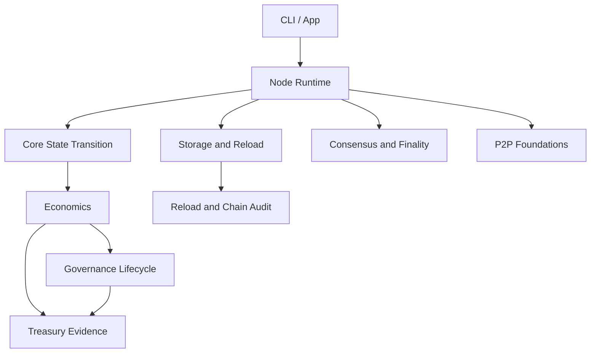

<h1 align="center">Nodo</h1>

<p align="center">
  Security-first blockchain infrastructure for verifiable protection, auditable economics, controlled treasury execution, governance evidence, and rebuildable state.
</p>

<p align="center">
  <a href="https://github.com/igors93/nodo/actions/workflows/ci.yml"></a>
  
  
  
  
  
</p>

<p align="center">
  <a href="#overview">Overview</a> |
  <a href="#features">Features</a> |
  <a href="#quick-start">Quick Start</a> |
  <a href="#architecture">Architecture</a> |
  <a href="#documentation">Documentation</a> |
  <a href="#roadmap">Roadmap</a>
</p>

## Overview

Nodo is an experimental C++20 blockchain protocol foundation focused on making security work measurable, state auditable, economics controlled, and finalized history rebuildable.

The current repository is not a production mainnet. It contains a working localnet runtime, testnet-candidate foundations, strict storage/reload checks, P2P transport foundations, treasury execution evidence, governance vote evidence, and extensive tests. Mainnet remains intentionally blocked until custody, networking, economics, storage, and operational safety have been audited and hardened.

## Why Nodo

Many blockchain systems treat protection as background infrastructure. Nodo treats protection as a protocol concern: validators, peers, treasury actions, governance decisions, rewards, penalties, storage, reload, and finality should leave evidence that another node can verify later.

The design target is simple:

- state should be rebuilt from history;
- balances should have origin;
- monetary changes should be authorized;
- treasury spends should be policy checked;
- governance decisions should be vote-evidence backed;
- penalties should require evidence;
- rewards should be tied to measurable protection work.

## Core Principles

Nodo follows the Proof-of-Protection rule set:

| Principle | Meaning |
| --- | --- |
| No inflation without authorization. | Monetary expansion must be explicit and auditable. |
| No balance without origin. | Account state must trace back to genesis, mint, transfer, reward, or slash history. |
| No treasury spend without policy validation. | Treasury execution must satisfy limits, timelocks, approval, balance, and epoch checks. |
| No treasury approval without governance evidence. | Approvals must be reproduced from verified governance lifecycle records. |
| No governance decision without verifiable vote evidence. | Votes, tally, and decision must rebuild deterministically. |
| No reward without measurable protection work. | Reward foundations should be tied to auditable network protection. |
| No penalty without verifiable evidence. | Slashing and penalties must be idempotent and evidence-backed. |
| No state accepted if it cannot be rebuilt from history. | Reload and audit reject non-canonical or divergent state. |

See [Proof of Protection](docs/overview/proof-of-protection.md) for the deeper model.

## Features

Implemented foundations include:

- localnet runtime pipeline with initialization, transaction submission, block production, finalization, reload, and audit;
- CMake-based C++20 build with one test executable per `tests/**/*.cpp`;
- strict storage schema validation and atomic persistence helpers;
- canonical finalized artifacts with monetary, treasury, governance, validator, and slashing sections;
- account-state preview before block votes and deterministic state roots;
- OpenSSL Ed25519 user signatures and blst BLS12-381 validator signatures;
- P2P message, gossip, loopback, TCP, encrypted peer-channel, sync, and peer-rate-limiter foundations;
- treasury policy, spend validation, execution evidence, and finalized treasury audit;
- governance vote proof, vote evidence, vote-set audit, tally, decision audit, lifecycle persistence, and lifecycle-backed treasury approval;
- slashing evidence, validator penalty decisions, validator lifecycle, and containment-policy foundations;
- testnet-candidate readiness and operator diagnostics foundations.

## Current Status

| Area | Status |
| --- | --- |
| Localnet runtime | Implemented for development and testing. |
| Testnet candidate | Foundations exist; safety gates and diagnostics are active. |
| Mainnet | Blocked by design. Not suitable for production use. |
| P2P networking | Real socket/gossip foundations exist; production networking is still in progress. |
| Keys and custody | Local development keys exist; production custody is not ready. |
| Governance | Vote evidence and lifecycle audit foundations exist; public governance workflow is still in development. |
| Treasury | Evidence-backed execution validation exists; production operator process is still in development. |
| Economics | Monetary, reward, protection, penalty, and supply-audit foundations exist; final economic activation is not complete. |

## Quick Start

### Windows PowerShell

```powershell
$env:BLST_ROOT="$env:USERPROFILE\.nodo\deps\blst"
.\scripts\cmake_build.bat
.\scripts\cmake_test_all.bat
.\build\nodo.exe help
```

### Linux, macOS, Git Bash, or MSYS2

```bash
export BLST_ROOT="$HOME/.nodo/deps/blst"
./scripts/cmake_build.sh
./scripts/cmake_test_all.sh
./build/nodo help
```

If `blst` is not installed, see [Build](docs/getting-started/build.md).

## Build

Prerequisites:

- CMake 3.20 or newer;
- a C++20 compiler;
- OpenSSL libcrypto development files;
- external `blst` headers and library, installed outside this repository.

Windows:

```powershell
.\scripts\cmake_build.bat
```

Linux/macOS/MSYS2:

```bash
./scripts/cmake_build.sh
```

The binary is written to:

```text
build/nodo.exe   # Windows
build/nodo       # Unix-like environments
```

## Run Tests

Windows:

```powershell
.\scripts\cmake_test_all.bat
```

Linux/macOS/MSYS2:

```bash
./scripts/cmake_test_all.sh
```

CTest can also be run directly:

```bash
ctest --test-dir build/cmake --output-on-failure
```

## CLI / Node Commands

Common localnet flow:

```bash
build/nodo init --network localnet --data-dir .nodo
build/nodo keys create --network localnet --data-dir .nodo
build/nodo tx submit --data-dir .nodo
build/nodo block produce --data-dir .nodo
build/nodo node reload --network localnet --data-dir .nodo
build/nodo chain audit --data-dir .nodo
build/nodo status --data-dir .nodo
build/nodo diagnostics --network localnet --data-dir .nodo
```

Network profiles:

- `localnet`: development runtime path;
- `testnet-candidate`: official pre-testnet profile with safety gates;
- `mainnet`: intentionally blocked.

More commands are documented in [CLI](docs/getting-started/cli.md).

## Project Structure

| Path | Purpose |
| --- | --- |
| `apps/cli/` | CLI executable entrypoint. |
| `include/` | Public headers for protocol, runtime, economics, storage, P2P, and utilities. |
| `src/app/` | Command-line orchestration and local operator flows. |
| `src/core/` | Blocks, transactions, account state, validators, and state-transition foundations. |
| `src/consensus/` | Votes, rounds, quorum certificates, finalization, and proposer scheduling. |
| `src/economics/` | Monetary policy, treasury, governance, protection rewards, supply audit, and penalties. |
| `src/node/` | Runtime, storage/reload, finalized artifacts, diagnostics, readiness, and chain audit. |
| `src/p2p/` | Messages, gossip, TCP/loopback transport, sync, encryption, and peer limiting. |
| `src/storage/` | Atomic files, block storage, evidence stores, and persistence helpers. |
| `tests/` | CTest-discovered module tests. |
| `scripts/` | Build, test, cleanup, and dependency helper scripts. |
| `docs/` | Project documentation. |

## Architecture



Read [Architecture Overview](docs/architecture/architecture-overview.md) and [Module Map](docs/architecture/module-map.md).

## Documentation

Start with [docs/README.md](docs/README.md).

Key entry points:

- [Project Overview](docs/overview/project-overview.md)
- [Proof of Protection](docs/overview/proof-of-protection.md)
- [Quick Start](docs/getting-started/quick-start.md)
- [Build](docs/getting-started/build.md)
- [Testing](docs/getting-started/testing.md)
- [Architecture Overview](docs/architecture/architecture-overview.md)
- [Governance Vote Evidence](docs/governance/vote-evidence.md)
- [Treasury Execution Evidence](docs/treasury/treasury-execution-evidence.md)
- [Security Model](docs/security/security-model.md)
- [Roadmap](docs/ROADMAP.md)

## Roadmap

Completed foundations:

- localnet runtime pipeline;
- finalized artifact persistence and reload audit;
- monetary reports and supply audit foundations;
- treasury execution evidence;
- governance vote evidence and lifecycle audit;
- P2P transport/gossip/encrypted channel foundations;
- testnet-candidate readiness diagnostics.

In progress:

- official testnet runtime hardening;
- production key safety and custody boundaries;
- governance lifecycle transitions;
- validator reward settlement and protection scoring;
- network hardening and peer operations.

Planned:

- audited wallet/custody integration;
- staking-backed governance and validator economics;
- full production slashing lifecycle;
- mainnet readiness gates and external audit process.

See [Roadmap](docs/ROADMAP.md).

## Security

Nodo is security-focused but not suitable for production use. Do not use the current code as a mainnet, custody, treasury, or production validator system unless a future release explicitly says those paths are ready and audited.

Security documentation:

- [SECURITY.md](SECURITY.md)
- [Security Model](docs/security/security-model.md)
- [Threat Model](docs/security/threat-model.md)
- [Key Management](docs/security/key-management.md)

## Contributing

Read [CONTRIBUTING.md](CONTRIBUTING.md) and [Development Guide](docs/development/contributing.md).

Contribution expectations:

- build and test before proposing code changes;
- do not disable tests to hide failures;
- do not weaken protocol, economics, or security validation;
- keep comments in English and useful;
- prefer small, auditable changes.

## License

No repository license file is currently present. Until a license is added, do not assume open-source redistribution rights beyond what GitHub access permits.
