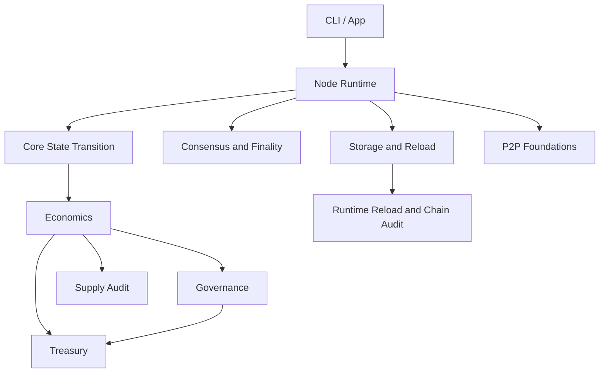

# Architecture Overview

Nodo is organized around runtime responsibilities: application orchestration, core state transition, consensus, economics, storage, P2P, serialization, and audit.

## Runtime Path

The localnet path is intentionally small but real:

1. initialize a node data directory;
2. create local keys;
3. submit transactions into the persistent mempool;
4. produce a candidate block;
5. preview state transition before voting;
6. collect validator votes and build finality records;
7. persist finalized artifacts;
8. reload runtime from storage;
9. run chain audit.

## Security Boundaries

- Consensus does not implement treasury or governance economics.
- Treasury execution validates policy and governance context before accepting spend evidence.
- Governance lifecycle verification rebuilds votes, tally, and decision before trusting persisted data.
- Storage rejects unknown schemas, missing fields, unexpected fields, and non-canonical data.
- Chain audit replays and verifies before accepting runtime state.
